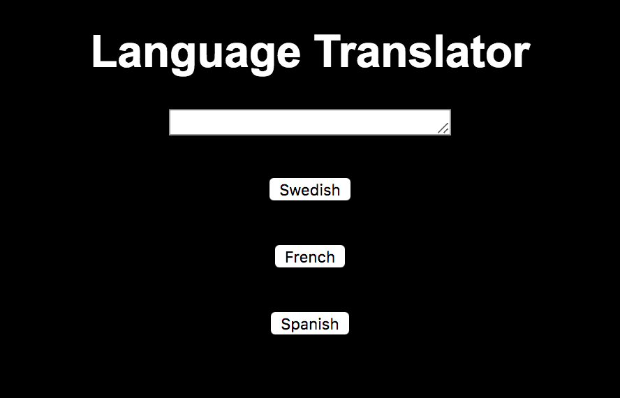

# Language Translator 

# Technologies Used:

    1. HTML5, CSS, JavaScript

# Description 

We created a a limited dictionary and used it to translate a holiday card message from English into another language. 

# Screenshots

# Instructions 

1. Go to: `https://www.npmjs.com/package/http-server` and install "http-server".  
2. Navigate to the project folder in command line interface and type: `http-server -p 8080`  
3. This will show at: `http://localhost:8080` in your internet browser.  
